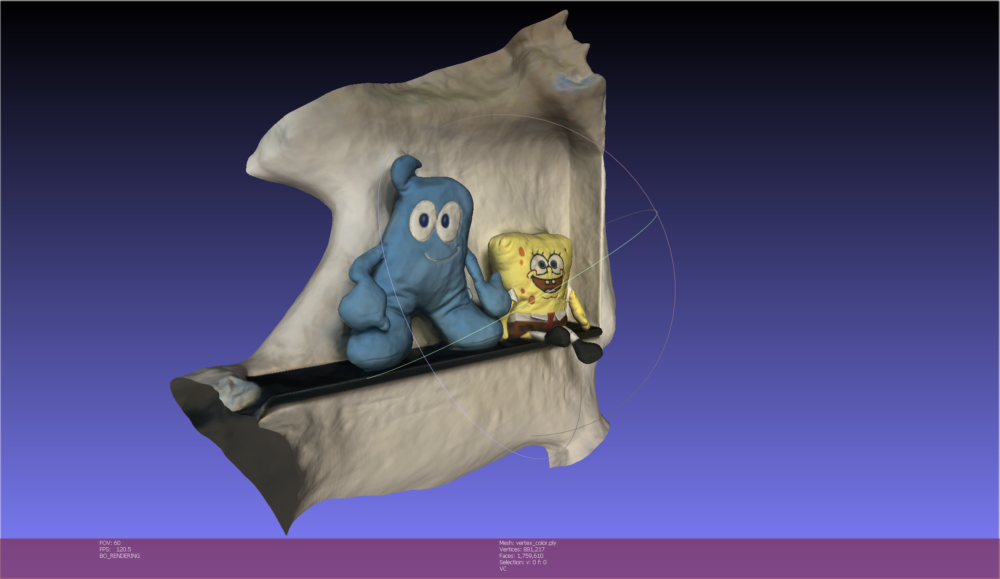

# Textured-NeuS

Thanks for the great work by @Totoro97. For the original work, please see https://github.com/Totoro97/NeuS.

## Origin of the project

In this project, joint method of NeRF, IDR and NeuS are used to reconstruct a 3D object. The original NeuS output is a plain model without texture, and it can only render the novel image with the trained model. However in downstream applications, the huge demand of 3D modeling costs large manpower, time and strengths. We must admit that in current stage computer graphics techniques cannot completely replace elaborately hand-crafted 3D models, especially for those with more complicated hierarchy (e.g. skeleton, clothes, MMD, metahumans). But within tolerated accuracy, reconstruction effect is actually enough for related applications and has significant potential in certain industries including game industries and daily life (including video making using C4D).

3D modeling is a very tough work in 3DMax and Maya, requiring one to fully master the usage of the functions in the software. But for general public, they usually have no time and cost digging into the learning of the software, keeping the modeling work isolated from daily life. Therefore, this project is developed to solve this problem.

## Nature of the project

This project is a undergraduate final year project, trying to find a method of generating 3D models automatically with low-cost publicly owned device, namely, mobile phones. Newer version of iPhone support using LiDAR to scan the surrounding environment, but with poor quality in empirical use. Also, in downstream industries, mesh objects, instead of point cloud objects, are largely used in applications. The successful representation methods in the work of NeRF provide us with a new view to settle down MVS construction problem -- using rays to optimize the networks. Combined NeRF ray representation with SDF representation, NeuS simultaneously maintain four networks to generate the scene objects.

As far as I am concerned, with my limited knowledge, the most advanced textured 3D model generation with high popularity until now is developed by @kwea123 (https://github.com/kwea123/nerf_pl/blob/master/README_mesh.md). It is an impressive work. Nevertheless, due to the ordinary reconstruction from NeRF, which uses the density $\rho$ to process marching cubes algorithm, causing fog-like radiance field to be noisy with many outliers, the actually generated model may be difficult to be used directly. Contrastively, the SDF representation in NeuS ensures the exported model to be watertight, thus reducing the noise of the model and make the surface smoother. Also, the color is represented by the color network with the same dimension and position input as the SDF network (taking the 3D coordinate x as the input), making it easier to give color to the vertices. The effect can be seen in the picture below.

For steps to derive the method, please see https://github.com/Totoro97/NeuS/issues/48.



## How to run

Nearly the same as the original repository. But we will still have a detailed guidance here.

### Environment installation

In order to have a stable development environment, we choose python 3.7:

```
conda create -n NeuS python=3.7
```

Then, install PyTorch in https://pytorch.org/:

```
conda install pytorch==1.8.0 torchvision==0.9.0 torchaudio==0.8.0 cudatoolkit=10.2 -c pytorch
```

For users in mainland China, mirror sources may be required.

After that, install other packages by pip:

```
pip install -r requirements.txt
```

### Training

We tend to use "training without mask" which is similar to actual situation:

```
python exp_runner.py --mode train --case <case_name>
```

#### 1. File structure

For a case, it must be under the directory of "public_data", and satisfy the structure as below:

```
<case_name>
|----image
     |----000.png
     |----001.png
     ...
     |----abc.png (where abc is a 3-digit number)
|----mask
	 |----000.png
     |----001.png
     ...
     |----abc.png (corresponding to image, needed even when using "womask" conf)
|----cameras_sphere.npz
```

The *cameras_sphere.npz* follows the representation in [IDR](https://github.com/lioryariv/idr/blob/main/DATA_CONVENTION.md), with the length of 6 * $n$, where $n$ is the camera number equivalent to the image number in the above folders (i.e. `image` and `mask`).

The elements in *cameras_sphere.npz*:

- world_mat_$n$ (the projection matrix, useful)
- ~~world_mat\_$n$\_inv~~
- scale_mat_$n$ (the normalization matrix making the model processed in a normalized unit sphere with the range of [-1, 1] on each axis, useful)
- ~~scale_mat\_$n$\_inv~~
- ~~camera_mat\_$n$~~ (only used to store camera intrinsic parameters, not useful)
- ~~camera_mat\_$n$\_inv~~

Though only 2 elements are useful, the form should still be followed.

#### 2. Datasets

Many datasets can be automatically transformed to this structure for further experiment, including [DTU](https://roboimagedata.compute.dtu.dk/?page_id=36), [BlendedMVS](https://github.com/YoYo000/BlendedMVS), and self-made datasets by [COLMAP SfM](https://colmap.github.io/). Especially, we aim to achieve good results in self-made datasets, which can demonstrate the potential of the project.

For dataset convert, please see https://github.com/xrr-233/Textured-NeuS-utils.

**Note:** The original repo provides the code to transform self-made data (under the `preprocess_custom_data` folder). It requires [Build-from-Source](https://colmap.github.io/install.html) (BfS) installation of COLMAP, which is relatively hard to configure (for me, I use Linux BfS in Ubuntu OS). But the more substantial thing is to understand the COLMAP SfM process. For assistance, two sources are provided here:

- https://github.com/Totoro97/NeuS/tree/main/preprocess_custom_data (Option 2)
- https://www.bilibili.com/video/BV135411G7sR (although in Chinese, the process is very clear and hope this can clearly state the COLMAP SfM process)

A processed self-made dataset is provided under `public_data/haibao`, where in the `preprocessed` folder it follows the above structure (Haibao is a cute mascot in 2010 Expo Shanghai) (I am sorry SpongeBob TwT).

#### 3. Configuration

With different hardware condition, training batch size can be adjusted in `conf/womask.conf`. The default batch size is 512, applicable when using RTX2060. Other parameters are also adjustable, like the `val_freq`, `val_mesh_freq` used for visualized test export. For detailed function of the parameters, see the code and the paper.

#### 4. Output

We set the final result mesh object to be exported automatically right after the end of training, using default validation arguments. Output model can be found in `exp/<case_name>/womask_sphere/meshes/final_result.ply`. If you want to apply a self-defined resolution, run:

```
python exp_runner.py --mode validate_mesh --case <case_name> --is_continue # use latest checkpoint
```

The result can be found in `exp/<case_name>/womask_sphere/meshes/self_defined_result.ply`

### Metrics

To verify the project's effect, experiments are currently being conducted. We plan to compare the PSNR, SSIM, and LPIPS of rendered images and rendered mesh images with given pose, as well as the ChamferL1 distance of the meshes.

We plan to use [NeRF reconstruction](https://github.com/kwea123/nerf_pl) to be the baseline model.

For experimental information, please see https://github.com/xrr-233/Textured-NeuS-utils.

## Acknowledgement

Tribute to

> ```
> @article{wang2021neus,
>   title={NeuS: Learning Neural Implicit Surfaces by Volume Rendering for Multi-view Reconstruction},
>   author={Wang, Peng and Liu, Lingjie and Liu, Yuan and Theobalt, Christian and Komura, Taku and Wang, Wenping},
>   journal={arXiv preprint arXiv:2106.10689},
>   year={2021}
> }
> ```

and those masters (in Chinses: 大佬) who provided their novel ideas.